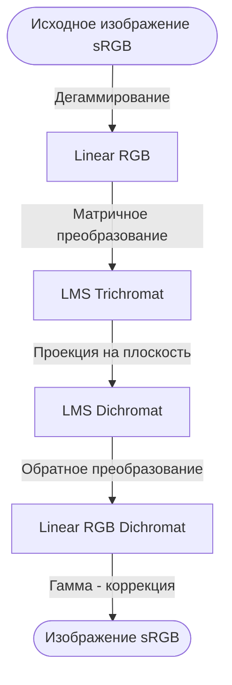
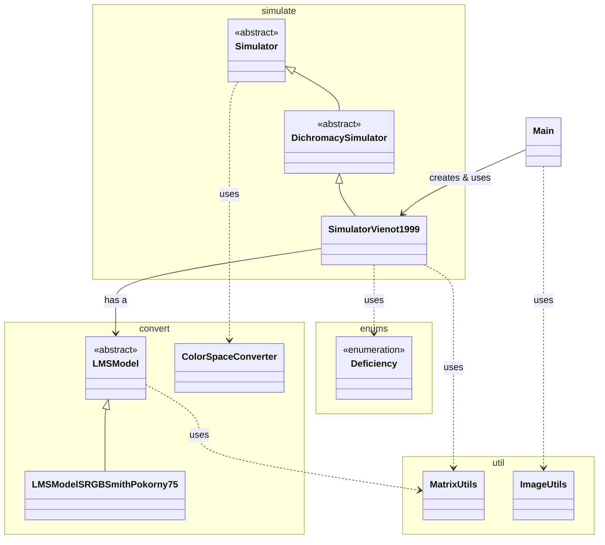
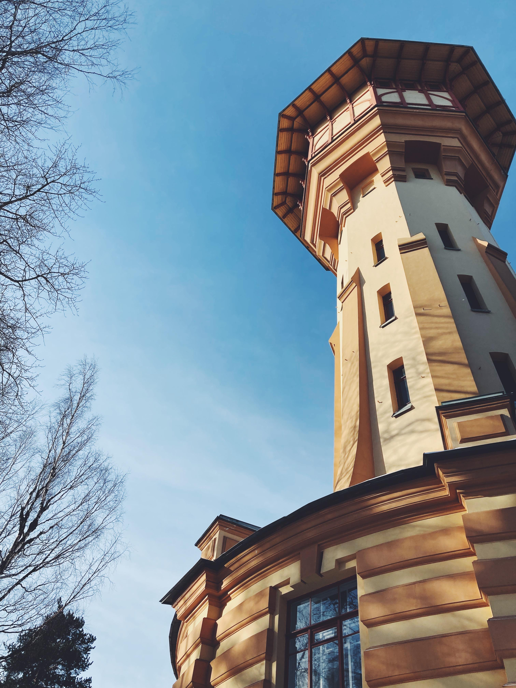

Консольная утилита для оптимизации размера графических файлов в рамках выпускной квалификационной работы бакалавра в Санкт-Петербургском политехническом университете Петра Великого.

Программа удаляет цветовую информацию, неразличимую для
людей с нарушениями цветовосприятия (дихромазией). В результате обработки происходит проекция цветов на плоскость неразличимости, что снижает энтропию изображения и
позволяет уменьшить объем занимаемых данных без визуальной потери качества для целевой аудитории.

- **Язык:** Java 8.
- **Форматы изображений:** JPG, PNG, BMP.

---

1. [Архитектура](#1-архитектура)
2. [Запуск проекта](#2-запуск-проекта)
3. [Документация](#3-документация)

---

### 1. Архитектура

В основе работы лежат алгоритмы моделирования дихроматического зрения (Vienot, 1999) и преобразования цветовых
пространств (Smith & Pokorny, 1975).

#### Конвейер обработки данных



#### Диаграмма классов



---

### 2. Запуск проекта

1. Клонирование репозитория:
```bash
git clone https://github.com/dfnabiullin/spbpu-cvd-simulator
cd spbpu-cvd-simulator
```

2. Компиляция:
```bash
mkdir out
javac -d out -sourcepath src src/Main.java
```

3. Запуск:
```bash
java -cp out Main <input_dir> <output_dir> [-d deficiency_type]
```

**Аргументы:**

- `<input_dir>` директория с исходными изображениями.
- `<output_dir>` директория для сохранения результатов.
- `-d` (опционально) тип симуляции: `protan`, `deutan` или `tritan`. По умолчанию используется `protan`.

---

### 3. Документация

Материалы выпускной квалификационной работы находятся в директории `docs/`:

- [Текст ВКР (PDF)](docs/ВКР_НабиуллинДФ.pdf)
- [Презентация к защите (PDF)](docs/Презентация_НабиуллинДФ.pdf)
- [Отзыв руководителя (PDF)](docs/Набиуллин%20ДФ%20отзыв.pdf)
- [Справка о проверке на плагиат (PDF)](docs/Certificate_1299_20250617_Набиуллин_Д_Ф.pdf)

---

### 4. Примеры

| Тип симуляции | Исходное фото               | Результат                             |
|---------------|-----------------------------|---------------------------------------|
| `-d protan`   |  |  |
| `-d tritan`   |  |  |
| `-d deutan`   |  |  |
